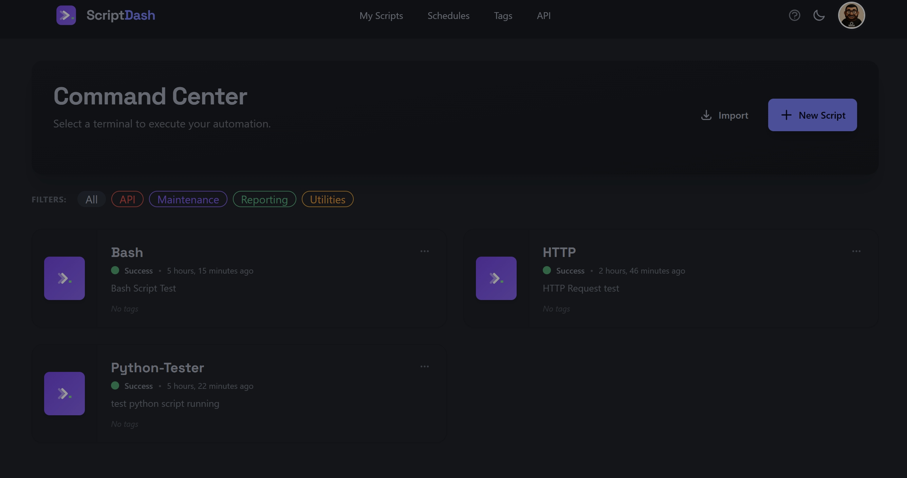
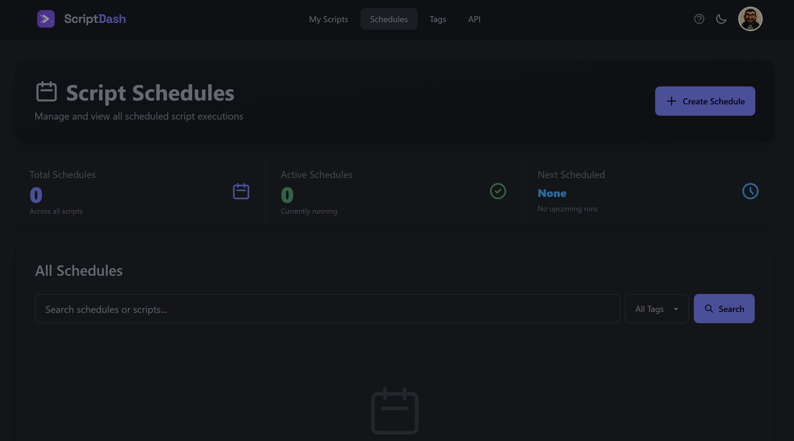
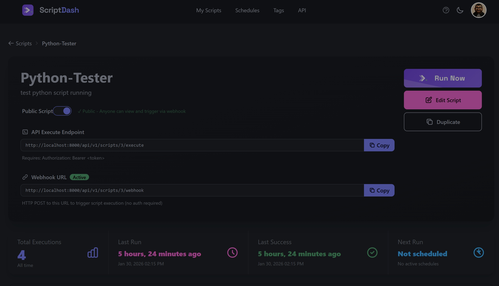
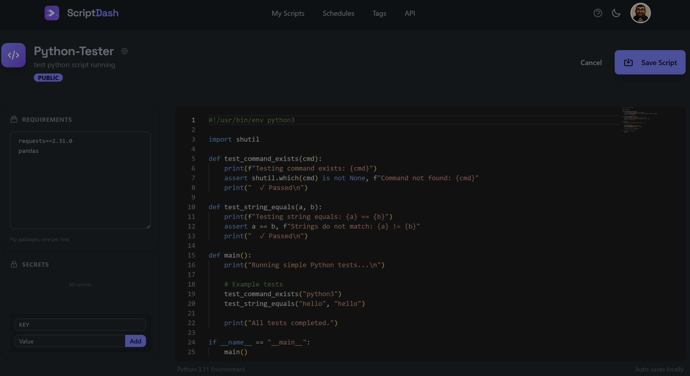

# 🚀 Python Runner

<div align="center">

**A beautiful web-based platform for managing, scheduling, and executing Python & Bash scripts**

[](https://opensource.org/licenses/MIT)
[](https://www.python.org/downloads/)
[](https://www.djangoproject.com/)

[Live Demo](#) • [Documentation](docs/) • [API Reference](docs/API_REFERENCE.md) • [Report Bug](https://github.com/cwhit-io/python-runner/issues)

</div>

---

## ✨ Why Python Runner?

Stop juggling cron jobs, virtual environments, and scattered scripts. **Python Runner** gives you a centralized platform to manage all your automation scripts with a beautiful, modern interface.

Perfect for:
- 🔄 **DevOps Engineers** - Automate deployments and infrastructure tasks
- 📊 **Data Engineers** - Schedule ETL jobs and data pipelines  
- 🤖 **Automation Enthusiasts** - Manage all your scripts in one place
- 🏢 **Small Teams** - Share and collaborate on automation scripts

## 🎯 Key Features

### 💻 Professional Code Editor
- **Monaco Editor** with syntax highlighting
- Dark/light themes with 29 options
- Auto-save and keyboard shortcuts
- Support for Python, Bash, and HTTP requests

### 🔒 Isolated Environments
- Each script runs in its own virtual environment
- Custom pip dependencies per script
- Smart dependency caching (only reinstalls on changes)
- Automatic conflict detection

### ⏰ Flexible Scheduling
- **Cron expressions** for complex schedules
- **Interval scheduling** for simple repeating tasks
- Enable/disable schedules on the fly
- View next run times at a glance

### 📈 Complete Execution History
- Full stdout/stderr capture
- Performance metrics (CPU, memory usage)
- Searchable execution logs
- One-click log copying

### 🎨 Beautiful Interface
- Modern, responsive design with DaisyUI
- 29 themes including dark mode
- Real-time status updates with HTMX
- Mobile-friendly

### 🔐 Secure & Shareable
- User authentication and authorization
- Encrypted secrets management
- API token authentication
- Optional public script sharing

### 🚀 Powerful API
- RESTful API with Django Ninja
- Auto-generated OpenAPI/Swagger docs
- Execute scripts remotely
- Integrate with any platform

## 📸 Screenshots

<div align="center">

### Script List


### Script Editor


### Execution Details


### Schedule Management


</div>

## 🚀 Quick Start

Get up and running in under 5 minutes:

```bash
# Clone the repository
git clone https://github.com/cwhit-io/python-runner.git
cd python-runner

# Create virtual environment
python -m venv venv
source venv/bin/activate  # On Windows: venv\Scripts\activate

# Install dependencies
pip install -r requirements.txt

# Setup database
python manage.py migrate

# Create admin user
python manage.py createsuperuser

# Start the server
python manage.py runserver
```

Visit **http://localhost:8000** and start creating scripts! 🎉

📚 For detailed installation instructions, see [Installation Guide](docs/INSTALLATION.md)

## 📖 Documentation

| Document | Description |
|----------|-------------|
| [Installation Guide](docs/INSTALLATION.md) | Detailed setup instructions |
| [User Guide](docs/USER_GUIDE.md) | How to use Python Runner |
| [API Reference](docs/API_REFERENCE.md) | Complete API documentation |
| [Architecture](docs/ARCHITECTURE.md) | Technical details for developers |
| [Docker Guide](docs/DOCKER.md) | Docker deployment |
| [Theming](docs/THEMING.md) | UI customization |

## 🎓 Usage Examples

### Create a Simple Script

1. Click **"Create Script"**
2. Add your Python code:
```python
import requests

response = requests.get('https://api.github.com')
print(f"GitHub API Status: {response.status_code}")
```
3. Add dependencies:
```
requests==2.31.0
```
4. Click **"Save"** and **"Run Now"**

### Schedule a Daily Task

1. Open your script
2. Click **"Add Schedule"**
3. Choose **Cron** and enter: `0 9 * * *` (runs at 9 AM daily)
4. Enable the schedule ✅

### Use the API

```bash
# Get your API token from Profile → API Tokens

# Execute a script remotely
curl -X POST \
  -H "Authorization: Bearer YOUR_TOKEN" \
  http://localhost:8000/api/v1/scripts/1/execute
```

## 🔧 Tech Stack

- **Backend:** Django 4.2, Django Ninja, APScheduler
- **Frontend:** HTMX, Alpine.js, Tailwind CSS, DaisyUI
- **Editor:** Monaco Editor (VS Code's editor)
- **Admin:** Django Unfold
- **Database:** SQLite (dev), PostgreSQL (prod)

## 🐳 Docker Deployment

```bash
# Development
docker-compose up

# Production
docker-compose -f docker-compose.prod.yml up -d
```

See [Docker Guide](docs/DOCKER.md) for details.

## 🤝 Contributing

We love contributions! Whether it's:

- 🐛 Bug reports
- 💡 Feature requests  
- 📝 Documentation improvements
- 🔧 Code contributions

Please open an issue or submit a pull request!

## 📝 License

This project is licensed under the MIT License - see the [LICENSE](LICENSE) file for details.

## 🙏 Acknowledgments

Built with amazing open-source tools:
- [Django](https://www.djangoproject.com/)
- [Django Ninja](https://django-ninja.rest-framework.com/)
- [Monaco Editor](https://microsoft.github.io/monaco-editor/)
- [HTMX](https://htmx.org/)
- [Tailwind CSS](https://tailwindcss.com/)
- [DaisyUI](https://daisyui.com/)

## 📮 Support

- 📧 Email: [your-email@example.com](mailto:your-email@example.com)
- 💬 GitHub Issues: [Report a bug](https://github.com/cwhit-io/python-runner/issues)
- 📖 Documentation: [Read the docs](docs/)

---

<div align="center">

**Made with ❤️ for the automation community**

[⭐ Star this repo](https://github.com/cwhit-io/python-runner) if you find it useful!

</div>
